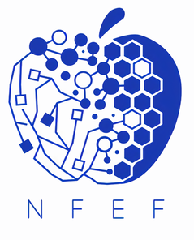

<!-- PROJECT SHIELDS -->
[![Repo Size][repo-size-shield]][repo-size-url]
[![Languages][languages-shield]][languages-url]
[![Contributors][contributors-shield]][contributors-url]
[![Forks][forks-shield]][forks-url]
[![Issues][issues-shield]][issues-url]
[![MIT License][license-shield]][license-url]

<!-- PROJECT LOGO -->
 

  

  <h3 align="center">NFEF-FCUL</h3>

  

    Website do Núcleo de Física e de Engenharia Física da Faculdade de Ciências da Universidade de Lisboa
     
    <a href="https://github.com/ErnestoFGonzalez/nfeffcul-www"><strong>Explorar docs »</strong></a>
     
     
    <a href="https://github.com/ErnestoFGonzalez/nfeffcul-www/issues">Reportar Bug</a>
    ·
    <a href="https://github.com/ErnestoFGonzalez/nfeffcul-www/issues">Pedir Feature</a>
  

<!-- TABLE OF CONTENTS -->
## Table of Contents

* [Sobre o NFEF-FCUL](#sobre-o-nfef-fcul)
  * [Website Construído Com](#website-construído-com)
* [Contribuir](#contribuir)
  + [Código de Conduta](#código-de-conduta)
  + [Licença](#licença)
  + [Convenções nas mensagens de commit no Git](#convenções-nas-mensagens-de-commit-no-git)

<!-- ABOUT NFEF-FCUL -->
## Sobre o NFEF-FCUL
O Núcleo de Física e de Engenharia Física da Faculdade de Ciências da Universidade de Lisboa foi criado a 19 de Maio de 2016. Conta já com a quarta geração e a nossa missão é garantir a representação dos estudantes de Física e Engenharia Física na faculdade, bem como permitir uma interação entre os alunos e o departamento.
O NFEF-FCUL tem, também, como objetivo complementar a experiência académica com eventos socais e pedagógicos. Dentro destes é importante destacar os churrascos bianuais, os diversos workshops, o programa do mentorado e o maior evento do núcleo, "Física Fora da Academia".

### Website Construído Com
* [Django](https://docs.djangoproject.com/en/3.1/)
* [Bootstrap](https://getbootstrap.com)

<!-- CONTRIBUTING -->
# Contribuir
Existem muitas maneiras de contribuir ao desenvolvimento do website, encontra a que se enquadra melhor com as tuas capacidades e interesses e abre in issue/pull request no repositório.

Exemplos de contribuições que nós adoramos:

- **Código**
- **Report de bugs**
- **Revisão de código**
- **Traduções**
- **Melhorias a UI**

## Código de Conduta

Por favor lê e segue o nosso [Código de Conduta](https://github.com/ErnestoFGonzalez/nfeffcul-www/blob/master/CODE_OF_CONDUCT.md).

## Licença

Qualquer contribuição está sob licença [MIT](https://opensource.org/licenses/MIT).

Por favor lê com atenção a nossa [licença](https://github.com/ErnestoFGonzalez/nfeffcul-www/blob/master/LICENSE) e pergunta-nos se tiveres alguma questão.

## Convenções nas mensagens de commit no Git

Ajuda-nos a manter o histórico do repositório consistente.

Usamos [gitmoji](https://gitmoji.carloscuesta.me/) como a nossa convenção de mensagens no git.

<!-- MARKDOWN LINKS & IMAGES -->
[repo-size-shield]: https://img.shields.io/github/repo-size/ErnestoFGonzalez/nfeffcul-www
[repo-size-url]: https://img.shields.io/github/contributors/ErnestoFGonzalez/nfeffcul-www
[languages-shield]: https://img.shields.io/github/languages/top/ErnestoFGonzalez/nfeffcul-www
[languages-url]: https://img.shields.io/github/contributors/ErnestoFGonzalez/nfeffcul-www
[contributors-shield]: https://img.shields.io/github/contributors/ErnestoFGonzalez/nfeffcul-www
[contributors-url]: https://github.com/ErnestoFGonzalez/nfeffcul-www/graphs/contributors
[forks-shield]: https://img.shields.io/github/forks/ErnestoFGonzalez/nfeffcul-www?label=forks&style=plastic
[forks-url]: https://github.com/ErnestoFGonzalez/nfeffcul-www/network/members
[issues-shield]: https://img.shields.io/github/issues/ErnestoFGonzalez/nfeffcul-www
[issues-url]: https://github.com/ErnestoFGonzalez/nfeffcul-www/issues
[license-shield]: https://img.shields.io/github/license/ErnestoFGonzalez/nfeffcul-www
[license-url]: https://github.com/ErnestoFGonzalez/nfeffcul-www/LICENSE
